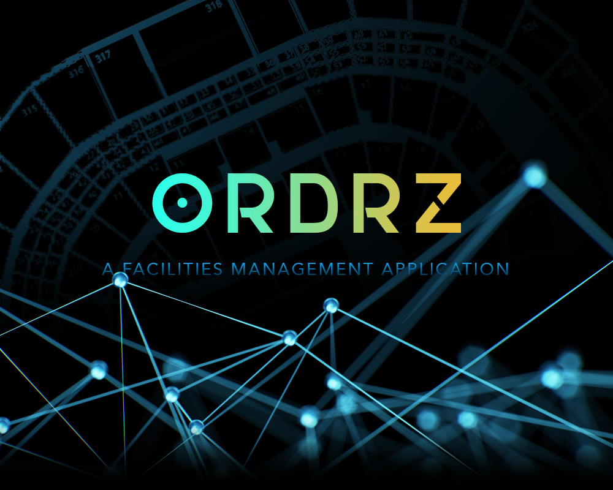
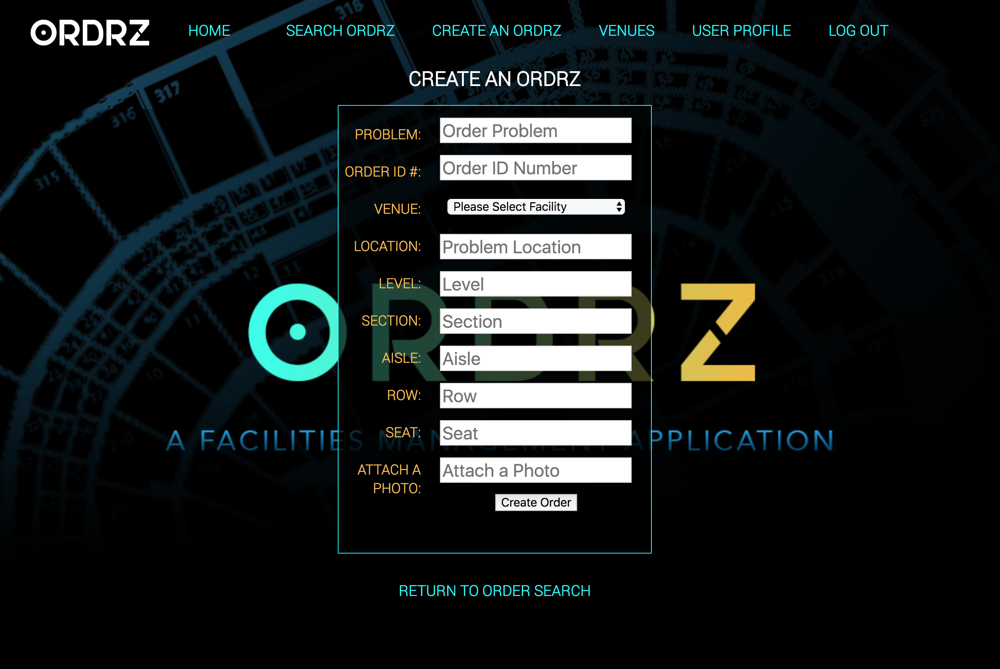
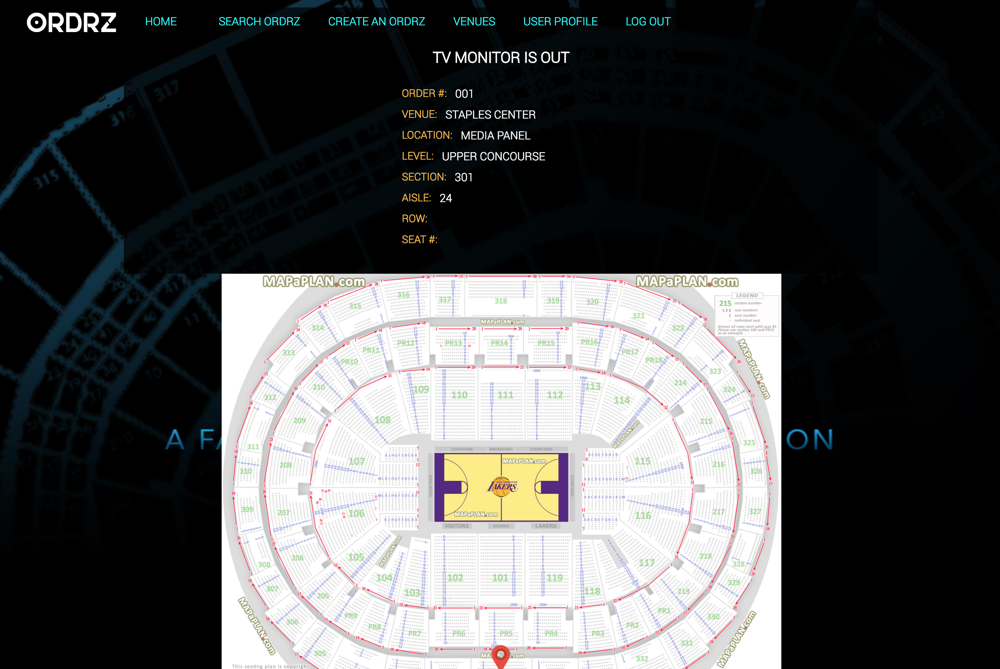

<h1>The Future of Facilities Management</h1>

ORDRZ&trade; take day-to-day facilities management to the next level. Using our mobile based and user friendly application, any employee can report on a maintanence problem and have an immediate response to resolve the issue. ...simply, and efficiently 

<h2>How to Use:</h2>

Enter your facility name and pertinent information into the ORDRZ&trade; App. Also include a visual layout of the facility. Using our pin-point feature, precisely mark the location of the concern. Department team members with access will be able to see the problem's location, and resolve the concern. All relavant team members and department heads can keep up with the progress of the open ORDRZ work-order. Notes, comments, and even photos can be attached to the work-order to provide the most information neccessary on the concern.

<h3>Development & Technologies -  ORDRZ&trade; is created in the REACT framework. Node.js, MONGO-DB, Javascript, HTML, & CSS</h3>
<h2>User Stories</h2>

As a User I want to easily create a Work Order 
As a User I want to describe in detail the problem 
As a User I want many people to have access to view the Work Order 
As a User I to show the location of the problem on a floorplan 
As a User I want feeback from my team on the Work Order 
As a User I want to be notified when the Work Order is complete 

<h2>MVP</h2>

Future Add-ons: 
Text messaging alerts 
Photo uploading of problem 
Uploading of facility floorplan 
GPS accuracy of location of problem 
Multi-floor floorplan support 
Team members or groups can be associated to Work Order 
Managerial control of work orders 
Administrative access versus employeee access 
Acurat searching function 
Unique order number generation 
Printable receipts and invoices 
